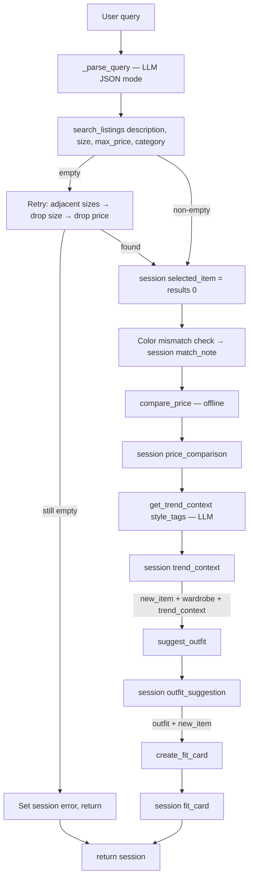

# FitFindr — planning.md

> Complete this document before writing any implementation code.
> Your spec and agent diagram are what you'll use to direct AI tools (Claude, Copilot, etc.) to generate your implementation — the more specific they are, the more useful the generated code will be.
> Your planning.md will be reviewed as part of your submission.
> Update it before starting any stretch features.

---

## Tools

List every tool your agent will use. For each tool, fill in all four fields.
You must have at least 3 tools. The three required tools are listed — add any additional tools below them.

### Tool 1: search_listings

**What it does:**
Searches the local listings dataset for secondhand items matching a keyword description, optionally narrowed by size and a price ceiling; returns matches ranked by relevance.

**Input parameters:**
- `description` (str, required): keywords for what the user wants (e.g. "linen blazer"). Matched fuzzily against each listing's title, description, style_tags, and colors.
- `size` (str, optional, default `None`): case-insensitive substring match ("M" matches "S/M"); None skips size filtering.
- `max_price` (float, optional, default `None`): inclusive price ceiling; `None` skips price filtering.

**What it returns:**
A list of listing dicts (list[dict]), each carrying the full field set (id, title, description, category, style_tags, size, condition, price, colors, brand, platform), scored by keyword overlap, zero-score items dropped, sorted highest-first. 

**What happens if it fails or returns nothing:**
Returns []. The Agent will decide how to present this to the user. 

---

### Tool 2: suggest_outfit

**What it does:** 
Given a found item and the user's existing wardrobe, calls the LLM to suggest 1–2 complete outfit combinations that pair the new piece with named items the user already owns, in an elevated-casual voice.

**Input parameters:**
<!-- List each parameter, its type, and what it represents -->
- `new_item` (dict): the listing dict returned by search_listings — the piece the user is considering buying.
- `wardrobe` (dict): the user's existing closet; contains an items key holding a list of wardrobe-item dicts. May be empty — handled gracefully.

**What it returns:**
A non-empty string describing 1–2 outfit combos, referencing specific wardrobe pieces by name. If the wardrobe is empty, returns general styling advice for the item instead (what pairs well, what vibe it suits).

**What happens if it fails or returns nothing:**
Empty wardrobe['items'] does not crash — the tool falls back to general styling advice. Always returns a non-empty string.

---

### Tool 3: create_fit_card

**What it does:**
Calls the LLM to turn a finished outfit into a short, shareable OOTD-style caption for the thrifted find.

**Input parameters:**
<!-- List each parameter, its type, and what it represents -->
- `outfit` (str): the outfit suggestion string returned by suggest_outfit.
- `new_item` (dict): the listing dict for the thrifted item, used to pull name, price, and platform.

**What it returns:**
A 2–4 sentence caption string, mentioning the item name, price, and platform once each naturally, capturing the outfit's vibe. Uses higher LLM temperature so output varies across runs for different inputs.

**What happens if it fails or returns nothing:**
If outfit is empty or whitespace-only, returns a descriptive error-message string (not an exception, not "").

---

### Additional Tools (if any)

### Stretch Tool: compare_price

**What it does:**
Compares a listing's price against all other items of the same category in the dataset and returns a price assessment with reasoning. Runs entirely offline — no LLM call.

**Input parameters:**
- `item` (dict, required): the listing dict being assessed.
- `all_listings` (list[dict], optional, default `None`): pre-loaded listings to compare against; loads from file if `None`.

**What it returns:**
A dict with keys: `verdict` (str: "great deal" / "fair price" / "above average" / "no comparables"), `item_price` (float), `median_price` (float | None), `comparable_count` (int), `reasoning` (str: one sentence explaining the verdict with the median and dollar difference).

**What happens if it fails or returns nothing:**
If no other listings share the same category, returns `{"verdict": "no comparables", "median_price": None, "comparable_count": 0, ...}` — never raises.

---

### Stretch Tool: get_trend_context

**What it does:**
Calls the Groq LLM to describe what's currently trending in fashion for a given set of style tags. The result is injected into `suggest_outfit` so trend awareness visibly influences the outfit suggestions.

**Input parameters:**
- `style_tags` (list[str], required): style descriptors from the selected listing (e.g. `["vintage", "grunge", "streetwear"]`).

**What it returns:**
A str — one sentence naming the most relevant current fashion trend for the given style tags. Uses temperature 0.3 for consistent output.

**What happens if it fails or returns nothing:**
Any LLM or network error returns an empty string. The planning loop checks for a non-empty trend_context before injecting it into the outfit prompt — an empty string is silently skipped.

---

## Planning Loop

**How does your agent decide which tool to call next?**
1. Loop receives a natural-language query and a wardrobe dict.
2. Parse the query into description, size, max_price, and category using an LLM JSON-mode call; store in session["parsed"]. Size words ("small") are normalized to dataset codes ("S").
3. Call search_listings(description, size, max_price, category).
4. Fork on the result:
   - If results == []: retry with progressively loosened constraints —
     a. Try adjacent letter sizes (XXS → XS → S) before dropping size entirely; set session["retry_note"] on success.
     b. If still empty, drop size filter entirely.
     c. If still empty and a price ceiling was set, drop price filter too.
     d. If still empty after all retries: set session["error"], leave downstream fields None, return session. (Why: downstream tools require a found item.)
   - If results is non-empty: continue ↓
5. Set session["selected_item"] = results[0]. Check for color mismatch between the queried color words and the item's colors field; set session["match_note"] if a queried color is absent.
6. Call compare_price(session["selected_item"]); store in session["price_comparison"]. (Offline — no LLM call.)
7. Call get_trend_context(session["selected_item"]["style_tags"]); store in session["trend_context"].
8. Call suggest_outfit(session["selected_item"], wardrobe, trend_context=session["trend_context"]); store in session["outfit_suggestion"].
9. Call create_fit_card(session["outfit_suggestion"], session["selected_item"]); store in session["fit_card"].
10. return session.

---

## State Management

**How does information from one tool get passed to the next?**
For each run there is a session dict with these fields (all start as None unless noted):

- `query` (str): original user query
- `parsed` (dict): extracted description, size, max_price, category from LLM parse
- `search_results` (list): full ranked list from search_listings
- `selected_item` (dict): results[0] — passed as new_item to suggest_outfit and create_fit_card
- `wardrobe` (dict): passed in unchanged, forwarded to suggest_outfit
- `outfit_suggestion` (str): returned by suggest_outfit — passed as outfit to create_fit_card
- `fit_card` (str): returned by create_fit_card
- `price_comparison` (dict): returned by compare_price — displayed in the listing panel
- `trend_context` (str): returned by get_trend_context — injected into the suggest_outfit prompt
- `retry_note` (str): set when search was retried with loosened parameters
- `match_note` (str): set when the top result doesn't match a queried color
- `error` (str): set if the interaction ended early; downstream fields stay None

Each tool writes its result into the session dict immediately after returning. The next tool reads from the session dict rather than receiving a local variable — this makes state visible and inspectable at every step.

---

## Error Handling

For each tool, describe the specific failure mode you're handling and what the agent does in response.

| Tool | Failure mode | Agent response |
|------|-------------|----------------|
| search_listings | No results match the query | Retries automatically: adjacent sizes first, then drop size, then drop price ceiling. If all retries fail, sets session["error"] with specific recovery suggestions and stops — downstream tools are never called. |
| suggest_outfit | Wardrobe is empty | Tool detects empty wardrobe["items"] and switches to a general-styling prompt that doesn't reference named wardrobe pieces. Always returns a non-empty string — never raises. |
| create_fit_card | Outfit string is empty or whitespace | Guards at entry: returns a descriptive error string without calling the LLM. Unlikely in practice since suggest_outfit guarantees a non-empty return. |
| compare_price | No other listings share the same category | Returns {"verdict": "no comparables", ...} — the UI omits the price check line rather than showing a meaningless result. Never raises. |
| get_trend_context | LLM call fails or returns empty | Returns an empty string. The planning loop checks before injecting into the outfit prompt — empty trend context is silently skipped. |

---

## Architecture

---

## AI Tool Plan

**Milestone 3 — Individual tool implementations:**
For each of the three tools I will use Claude Code, giving it the function signature from tools.py, the corresponding tool spec block from planning.md (inputs, return value, failure mode), and the instruction to use load_listings() from utils/data_loader.py rather than reimplementing file loading. Before running the generated code I will check that it filters by all three parameters, handles None values for size and max_price by skipping those filters, scores by keyword overlap against title/description/style_tags/colors, drops zero-score items, and returns [] on no match rather than None or raising. I will then run it against three queries: one that should return results, one with a price ceiling that excludes everything, and one impossible combination (e.g. designer ballgown, XXS, $5) that must return [] without crashing. 

Once I believe the implementation is complete I will use Copilot as a second opinion — giving it the spec and the generated code and asking it to identify any requirement mismatches or edge cases I may have missed, not to generate alternative code.

**Milestone 4 — Planning loop and state management:**
I will give Claude Code the Architecture diagram from planning.md and the Planning Loop + State Management sections, and ask it to implement run_agent() in agent.py. Before running I will verify the generated code branches on the search result (not just calls all three tools unconditionally), stores each tool's output in the session dict immediately after it returns, and passes session["selected_item"] as new_item and session["outfit_suggestion"] as outfit rather than using any hardcoded values. I will then run the no-results test case and confirm session["fit_card"] stays None and session["error"] is set.

**Stretch features — compare_price, retry logic, get_trend_context:**
For compare_price I gave Claude Code the tool spec (inputs, verdict thresholds, no-comparables fallback) and verified the median was computed from same-category items only, excluding the item itself, and that the "great deal" / "fair price" / "above average" thresholds matched the spec (−20% / +15%). I confirmed the result was stored in session["price_comparison"] and displayed in the listing panel with a verdict emoji.

For retry logic I described the desired behavior — try adjacent letter sizes before dropping size entirely, so an XXS user is never shown an XXL result — and asked Claude Code to implement it as an ordered expansion dict (_ADJACENT_SIZES). I verified XXS expands to ["XS", "S"] not ["S", "XS"], and that numeric sizes (shoe sizes, waist sizes) return [] and fall through to dropping size entirely.

For get_trend_context I gave Claude Code the tool spec and asked it to inject the result into the suggest_outfit prompt as a "Current trend context" note. I verified the trend string was stored in session["trend_context"], prepended to the outfit panel in the UI as "Trending now: ...", and that an empty trend_context was silently skipped rather than appended as blank text.

---

## A Complete Interaction (Step by Step)

**Example user query:** "I'm looking for a vintage graphic tee under $30. I mostly wear baggy jeans and chunky sneakers. What's out there and how would I style it?"

**Step 1:**
The planning loop extracts description="vintage graphic tee", size=None (not specified), and max_price=30.0 from the query and calls search_listings("vintage graphic tee", size=None, max_price=30.0). The tool scores all listings by keyword overlap against title, description, style_tags, and colors, drops zero-score items, filters out anything over $30, and returns a sorted list. The top result is the Vintage Band Tee — Faded Grey ($19, depop, fair condition). The loop sets session["selected_item"] to that listing dict.

**Error path:**
 If search_listings returns [] — for example, search_listings("designer ballgown", size="XXS", max_price=5.0) — the loop sets session["error"] to a message telling the user nothing matched and suggesting they drop the size filter, raise the price ceiling, or simplify their keywords, and returns immediately. suggest_outfit and create_fit_card are never called.

**Step 2:**
The loop calls suggest_outfit(new_item=session["selected_item"], wardrobe=get_example_wardrobe()). The tool formats the wardrobe items and the new piece into a prompt and calls the Groq LLM, which returns outfit suggestions pairing the band tee with named wardrobe pieces. The loop sets session["outfit_suggestion"] to that string. ("error path" doesn't happen, calling because step 1 successful and will give generic advice if wardrobe is None.)

**Step 3:**
The loop calls create_fit_card(outfit=session["outfit_suggestion"], new_item=session["selected_item"]). The tool prompts the LLM for a casual OOTD caption mentioning the item name, price, and platform naturally. The loop sets session["fit_card"] to the returned caption string.

**Final output to user:**
The Gradio interface populates three panels — the search result panel shows the Vintage Band Tee listing details, the outfit suggestion panel shows the LLM's styled combination using named wardrobe pieces, and the fit card panel shows the shareable caption.
